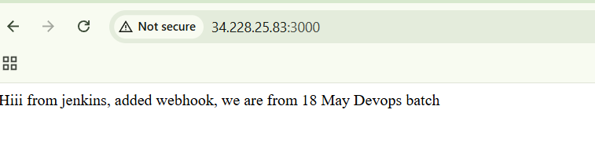

# Node.js App

A simple Node.js application built with **Express.js** and designed to
be used with **Jenkins CI/CD and webhooks**.

## 📌 Project Overview

This project runs a basic Express.js web server on port **3000**.

When a user opens the application in a browser, it displays a welcome
message related to the Jenkins and DevOps batch.

## 🛠️ Technologies Used

-   Node.js
-   Express.js
-   Jenkins
-   Git / GitHub
-   Webhook
-   AWS EC2 (if deployed on AWS)

## 📂 Project Structure

``` text
nodejs-app/
├── app.js
├── package.json
└── README.md
```

### app.js

The main application file. It:

-   Imports Express.js
-   Creates an Express application
-   Runs the server on port `3000`
-   Provides a `/` route
-   Displays a welcome message

### package.json

The Node.js project configuration file. It contains:

-   Project name: `Jenkins-node-app`
-   Main file: `app.js`
-   Start command: `node app.js`
-   Express.js dependency

## 🚀 How to Run the Project

### 1. Clone the repository

``` bash
git clone https://github.com/mshruti759/nodejs-app.git
cd nodejs-app
```

### 2. Install dependencies

``` bash
npm install
```

This installs Express.js and other dependencies listed in
`package.json`.

### 3. Start the application

``` bash
npm start
```

You should see a message similar to:

``` text
App listening at http://localhost:3000
```

### 4. Open the application

On the same machine, open:

``` text
http://localhost:3000
```

If the application is running on an AWS EC2 instance, make sure port
**3000** is allowed in the EC2 Security Group, then open:

``` text
http://YOUR-EC2-PUBLIC-IP:3000
```

## 🔄 Jenkins / Webhook

This project can be connected to Jenkins for CI/CD.

A typical workflow is:

``` text
Developer
   ↓
GitHub
   ↓
GitHub Webhook
   ↓
Jenkins
   ↓
Build / Test
   ↓
Deploy Node.js Application
```

Whenever code is pushed to GitHub, a webhook can notify Jenkins and
trigger the configured Jenkins job.

## 📦 Useful Commands

``` bash
npm install
npm start
node app.js
```

Git commands:

``` bash
git status
git add .
git commit -m "Update project"
git push origin main
```
## Output



## 👩‍💻 Author

**Shruti More**

